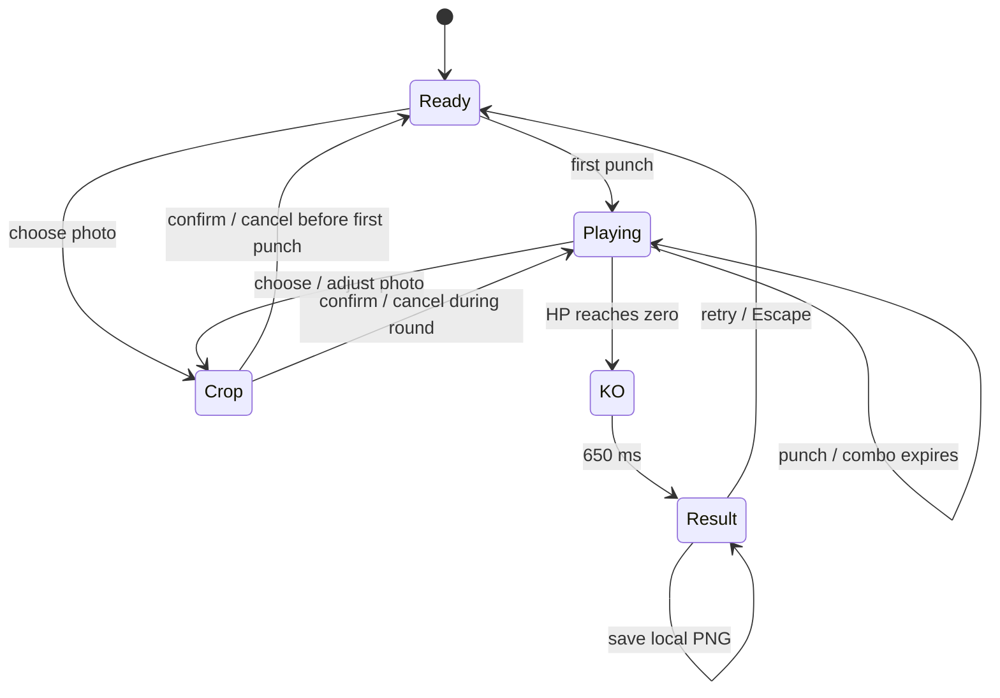

# 친구 샌드백 — Vertical slice design

2026-09-08 · Concept B · Sandbag only

## Decision and playable promise

“툭 치면, 빵 터진다.” A big, soft bag wearing one familiar face reacts to the player's own tap. The first screen is already playable. Upload is optional, never a gate. Comedy comes from squash and cartoon accessories, without injury imagery or social rankings.

Source: `/workspace/friend-game-briefs/CONCEPT_ANALYSIS.md`, Concept B, and `SCOPE.txt`. The explicit Sandbag-only override controls this phase. Friend Cannon is excluded. Existing Smash v2 is preserved as Classic; this slice is the new default entry.

## First five seconds and replay

1. Open `/`: the bag, full HP, and orange punch button are visible immediately.
2. Tap the bag or button: HP changes on that input; the face squashes and recoils, a comic word and bounded confetti appear.
3. Keep tapping: a visible combo deadline makes the rhythm legible; three hits reveal star eyes.
4. Optional local photo: choose → drag/zoom or use horizontal/vertical sliders → confirm. Cancel keeps the previous face.
5. KO → a short 650 ms visual payoff → result and one-click retry. The chosen face is retained. Escape from the result also starts a fresh round.

A continuous combo takes 32 hits to KO; separate taps take 45. At a casual 2–3 hits/second a round is roughly 11–23 seconds, plus pauses. A rapid automated sequence is much shorter. The intended 30-second–3-minute session consists of several short rounds and photo/sticker changes; retention has not been established by human playtesting.

The crop dialog blocks punch input but does not reset the current round. The combo naturally expires while editing. Hidden pages cancel the animation loop and clear the active combo; the round resumes when visible.

## Mechanics contract

| Element | Value / behavior |
| --- | --- |
| Starting HP | 360, clamped at zero |
| Punch damage | `8 + min(6, floor(combo / 4))` |
| Combo window | 850 ms; a hit at the exact deadline still continues |
| Input rate cap | One hit per 70 ms; no held-key repeat |
| Pointer target | Bag area, including its small recoil envelope; empty floor does not damage |
| Keyboard / touch | Native button activation, Space/Enter, pointer input; no double damage from synthesized clicks |
| Reaction thresholds | 3 = stars, 6 = spirals, 10 = moustache/monocle |
| Sticker lifetime | Unlocked for the current round; automatic selection follows new hits; manual selection stays until changed |
| KO | Further damage disabled, result once, final spiral sticker and KO stamp |
| Retry | Reset HP/combo/hits/unlocks/timing/particles; keep photo, sound/motion settings, session KO count |
| Best combo | Updated live, persisted at KO; safe fallback when storage unavailable |

The four reactions are authored Canvas paths. Uploaded photos use the same paths and bag transform. No mesh warp, texture remapping, remote generation, or per-frame photo decoding is involved.

## Visual artifacts and hierarchy

Cream paper, olive gym equipment, a warm orange action color, dark outlines, and a friendly yellow practice face. The canvas keeps the face large and the background quiet. The desktop sidebar contains optional setup, the three discoverable stickers, and a personal record. On mobile the bag is first, then the setup and compact record panels.

| Artifact | Purpose |
| --- | --- |
| [Desktop ready](docs/artifacts/desktop-ready.png) | First screen, hierarchy, Classic entry |
| [Mobile ready](docs/artifacts/mobile-ready.png) | Touch layout and full-page flow |
| [Desktop combo](docs/artifacts/desktop-combo.png) | Moustache milestone and unlocked sticker controls |
| [Mobile combo](docs/artifacts/mobile-combo.png) | Small-screen reaction layout |
| [Desktop KO](docs/artifacts/desktop-ko.png) | Result, stats, retry and download |
| [Mobile KO](docs/artifacts/mobile-ko.png) | Modal sizing on a phone viewport |
| [Exported KO card](docs/artifacts/desktop-ko-card.png) | Actual PNG output with a synthetic test face |
| [Classic play](docs/artifacts/classic-play.png) | Preserved old mode running independently |
| [Performance JSON](docs/artifacts/performance.json) | Reproducible raw timing measurements |

These are actual browser captures, not mockups. The test face is a locally generated illustration, not a real participant photo.

## 60 FPS budget and implementation

`src/main.js` owns DOM/input, photo handling and frame scheduling. `src/sandbag.js` owns deterministic round rules and crop bounds. `src/sandbag-renderer.js` owns drawing and bounded cosmetic physics. `classic.html` loads the separate legacy bundle; none of its simulation is imported by Sandbag.

- One `requestAnimationFrame` loop and Canvas 2D; 16.67 ms is the 60 Hz frame budget.
- A 1.5 maximum backing-store DPR and a one-million-pixel canvas ceiling.
- At most 48 particles; expired particles are removed in place.
- One 320×320 face texture during play; bounded 1600px source retained for re-cropping.
- Spring integration capped at 33 ms per callback to avoid large resume jumps.
- Gameplay DOM updates only on input/milestones; combo timer uses a transform. FPS text updates once per second with at most 180 interval samples.
- The hidden-tab loop is canceled, and animation resumes with fresh timing.
- No blur/shadow filters, external font downloads, network requests during play, or full-body physics.
- Sound uses short-lived oscillators disconnected on completion; off by default.
- Card rendering and PNG encoding occur only after an explicit save click.

The live FPS indicator reports observed callback cadence, not a fixed “60” claim. Measurements distinguish frame cadence from JavaScript callback cost. Physical low-end Android and iOS devices still need validation.

## Faces and accessibility

Photo input accepts common raster formats up to 12 MB. After successful decode, reject more than 40 million pixels, flatten and downsample once, then show a local crop editor. Browser decoding still briefly allocates the original image before that dimension check. Crop positions are clamped so dragging/zooming cannot leave blank borders. Object URLs are revoked in `finally`. A saved crop is held only in memory, and removal/reload clears app references to it. No photo bytes are stored in localStorage.

Korean labels and status copy, native buttons/dialog focus, keyboard-accessible crop sliders, HP progress semantics, milestone announcements, and opt-in audio are included. Reduced-motion mode removes sway and squash and reduces particles. There is no audio-only dependency. Full screen-reader and real-device accessibility audits remain future validation.

## Slice boundary and next evidence

Included: immediate punch loop, one face, local crop, HP/combo, four flat reactions, KO/retry, PNG souvenir, Korean responsive UI, personal best, separate Classic, tests, and performance artifacts.

Deferred: finisher mechanics, weapons, punchout, multiplayer, rankings, accounts, video recording, monetization, and new arenas. The next useful product evidence is a small human playtest of first-action clarity, laugh moments, voluntary retries, and photo setup. Automated repetition verifies stability, not fun or retention.
